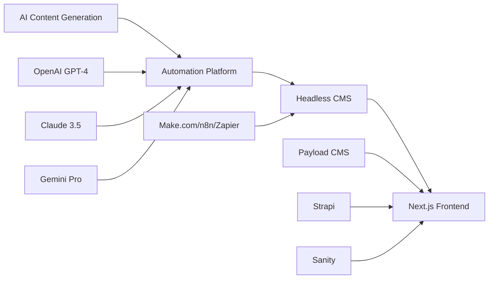
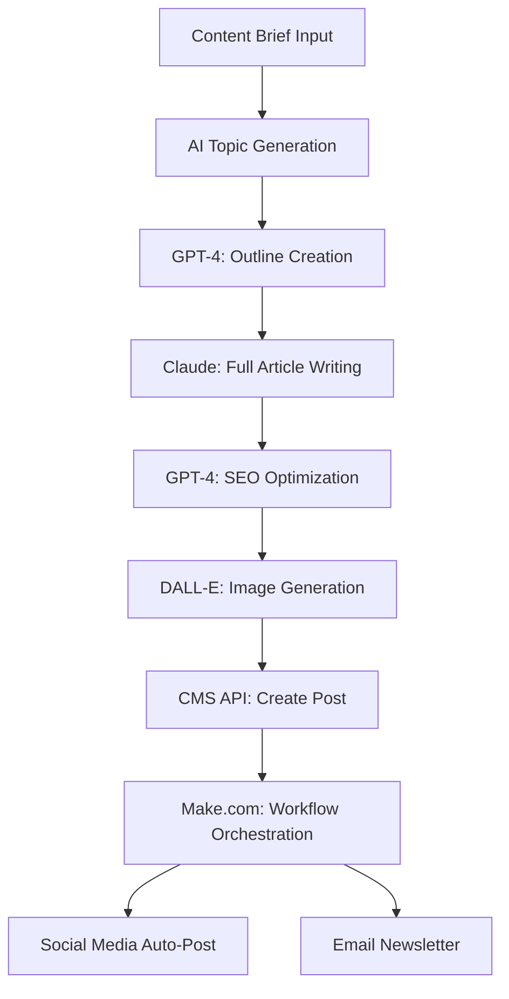
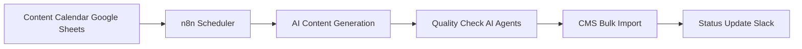
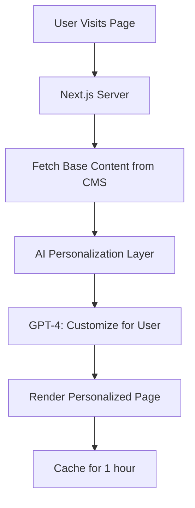

# 🤖 AI-Powered Content Automation Solutions (2026)
## Complete Guide to Automated Content Generation & CMS Integration

> **Mission**: Build an intelligent content automation system with AI generation, workflow automation, and seamless CMS integration.

---

## 📋 Table of Contents

1. [AI-Powered CMS Solutions](#ai-powered-cms-solutions)
2. [AI Content Generation APIs](#ai-content-generation-apis)
3. [Automation Platforms](#automation-platforms)
4. [Complete Automation Stack Recommendations](#automation-stack-recommendations)
5. [Implementation Architectures](#implementation-architectures)
6. [Cost Analysis](#cost-analysis)

---

## 🎯 THE WINNING FORMULA



---

## 🚀 CATEGORY 1: AI-Powered CMS Solutions

### 1. **Builder.io** 🔥 TOP PICK FOR AI + AUTOMATION

**What It Is**: Visual page builder with **native AI content generation** built-in.

#### ✅ AI Features:
- **Visual Copilot AI** (AI assistant for content generation)
- **AI Text & Image Generation** from prompts
- **Figma to Code** (AI-powered design conversion)
- **A/B Test Variations** (AI-generated)
- **Personalization AI** (dynamic content)
- **Data Binding** (AI generates layouts from APIs)

#### 🔌 Automation Capabilities:
- **Write API** (programmatic content creation)
- **Content API** (fetch/update via REST)
- **Webhooks** (trigger workflows on events)
- **Bulk Operations** support

#### 💰 Pricing:
- **FREE**: 1,000 visitors/month + AI features
- **Growth**: $29/month (50k visitors)
- **Business**: Custom

#### 🎯 Perfect For:
- Marketing teams needing rapid page creation
- AI-first content generation workflows
- Landing page automation

#### 🔗 Resources:
- [builder.io](https://www.builder.io)
- [builder.io/c/docs/ai](https://www.builder.io/c/docs/ai)

---

### 2. **Sanity** 💎 ENTERPRISE AI

**What It Is**: Real-time headless CMS with **AI-powered workflows**.

#### ✅ AI Features:
- **AI-Powered Translation** (automatic localization)
- **Automated Content Workflows**
- **Smart Content Recommendations**
- **AI Asset Tagging**
- **Predictive Content Insights**

#### 🔌 Automation Capabilities:
- **GROQ API** (powerful queries)
- **Real-Time APIs** (instant sync)
- **Webhooks & Mutations**
- **Sanity CLI** (bulk operations)

#### 💰 Pricing:
- **FREE**: 3 users, 10k docs
- **Growth**: $99/month
- **Team**: $249/month

#### 🎯 Perfect For:
- Large-scale content operations
- Multi-language automation
- Real-time collaboration

---

### 3. **Prismic** 🎨 AI COMPONENT CREATION

**What It Is**: Headless CMS with **AI component generators**.

#### ✅ AI Features:
- **AI Component Creation** (auto-generate page sections)
- **Content Validation** (brand consistency checks)
- **SEO Optimization** (AI-powered suggestions)
- **Personalization Engine**

#### 🔌 Automation Capabilities:
- **Prismic API** (RESTful)
- **Webhooks** (content triggers)
- **Slice Machine** (component automation)

#### 💰 Pricing:
- **FREE**: Unlimited repos
- **Small**: $7/user/month

---

### 4. **Storyblok** 🛠️ AUTOMATED WORKFLOWS

**What It Is**: Visual editor CMS evolving for **AI content era**.

#### ✅ AI Features:
- **AI-Powered Content Suggestions**
- **Automated Translation**
- **Smart Asset Management**
- **Content Optimization**

#### 🔌 Automation Capabilities:
- **Management API** (CRUD operations)
- **Content Delivery API** (CDN-powered)
- **Webhooks** (real-time triggers)
- **CLI Tools** (bulk imports)

#### 💰 Pricing:
- **FREE**: 1 user, 25k requests/month
- **Standard**: $39/month

---

### 5. **Payload CMS** ⚡ DEVELOPER'S CHOICE

**What It Is**: TypeScript CMS with **complete API control** for custom AI integration.

#### ✅ AI Integration Potential:
- **100% API-First** (integrate any AI model)
- **Hooks System** (custom automation triggers)
- **Serverless Functions** (AI processing)
- **Admin Customization** (embed AI tools)

#### 🔌 Automation Capabilities:
- **REST & GraphQL APIs**
- **Hooks & Lifecycle Methods**
- **Access Control** (programmatic)
- **Bulk Operations** via API

#### 💰 Pricing:
- **FREE** (self-hosted)

#### 🎯 Perfect For:
- Custom AI workflows
- Full automation control
- Developer-led projects

---

## 🧠 CATEGORY 2: AI Content Generation APIs

### 1. **OpenAI GPT-4 Turbo** 🤖 INDUSTRY STANDARD

**Capabilities**:
- Blog posts, articles, product descriptions
- Social media content
- Email campaigns
- SEO-optimized content
- Code generation

**Pricing**:
- **GPT-4 Turbo**: $0.01/1k input tokens, $0.03/1k output
- **GPT-4o**: $0.005/1k input, $0.015/1k output

**Best For**: General-purpose content, creative writing

---

### 2. **Anthropic Claude 3.5 Sonnet** 💬 PREMIUM QUALITY

**Capabilities**:
- Long-form content (200k token context)
- Technical writing
- Research-heavy articles
- Brand voice consistency
- **Model Context Protocol (MCP)** for CMS integration

**Pricing**:
- **Claude 3.5 Sonnet**: $0.003/1k input, $0.015/1k output
- **Claude 3 Haiku** (fastest): $0.00025/1k input, $0.00125/1k output

**Best For**: High-quality, nuanced content

---

### 3. **Google Gemini Pro** 🌐 MULTIMODAL

**Capabilities**:
- Text + image understanding
- Real-time web search integration
- Video content analysis
- Multi-language support

**Pricing**:
- **FREE** tier (60 requests/min)
- **Gemini Pro**: $0.000125/1k chars input, $0.000375/1k output

**Best For**: Multimodal content, research-based writing

---

### 4. **Jasper AI** 📝 MARKETING-FOCUSED

**Capabilities**:
- Pre-built marketing templates
- Brand voice training
- Content campaigns
- SEO optimization
- Multi-channel content

**Pricing**:
- **Creator**: $49/month (1 user)
- **Teams**: $125/month (3 users)

**Best For**: Marketing teams, branded content

---

### 5. **Copy.ai** ✍️ WORKFLOW AUTOMATION

**Capabilities**:
- Sales copy
- Ad campaigns
- Email sequences
- Content ideation
- Translation

**Pricing**:
- **FREE**: 2,000 words/month
- **Pro**: $49/month (unlimited)

---

## 🔧 CATEGORY 3: Automation Platforms

### 1. **Make.com** 🎯 BEST FOR COMPLEX AI WORKFLOWS

**Why Choose Make.com**:
- **Visual Workflow Builder** (drag & drop)
- **350+ AI App Connectors**
- **Native AI Module** (direct LLM prompts)
- **Parallel Processing** (multiple AI calls)
- **Cost-Effective** for high-volume

#### AI-Specific Features:
- Direct OpenAI, Claude, Gemini integration
- AI content moderation
- Sentiment analysis
- Text classification
- Image generation workflows

#### Example Workflow:
```
1. Trigger: New CMS entry created
2. AI: Generate content with GPT-4
3. AI: Optimize for SEO with Claude
4. AI: Create featured image with DALL-E
5. CMS: Update entry with generated content
6. Social: Auto-post to channels
```

#### Pricing:
- **FREE**: 1,000 operations/month
- **Core**: $9/month (10k ops)
- **Pro**: $16/month (40k ops)

---

### 2. **n8n** 🛠️ BEST FOR DEVELOPERS

**Why Choose n8n**:
- **Open-Source** (self-hosted free)
- **LangChain Integration** (advanced AI agents)
- **Custom Code Nodes** (JavaScript/TypeScript)
- **AI Agent Builder** (autonomous workflows)
- **Data Sovereignty** (complete control)

#### AI-Specific Features:
- AI agent creation
- Memory & context management
- Multi-model orchestration
- RAG (Retrieval-Augmented Generation)
- Vector database integration

#### Example Workflow:
```
1. Trigger: Schedule (daily at 9 AM)
2. AI: Generate 10 blog topics (GPT-4)
3. AI: Write full articles (Claude)
4. AI: Generate meta descriptions (GPT-4)
5. CMS: Bulk create posts (Payload API)
6. Email: Notify team of new posts
```

#### Pricing:
- **FREE** (self-hosted)
- **Cloud Starter**: $20/month (2,500 executions)
- **Cloud Pro**: $50/month (10k executions)

---

### 3. **Zapier** 📱 EASIEST FOR BEGINNERS

**Why Choose Zapier**:
- **8,000+ Integrations** (largest ecosystem)
- **ChatGPT Plugin** (direct GPT-4 access)
- **AI Copilot** (workflow suggestions)
- **No-Code** (visual builder)
- **Quick Setup** (pre-built templates)

#### AI-Specific Features:
- ChatGPT integration
- OpenAI actions
- AI-powered formatter
- Text summarization
- Sentiment detection

#### Example Workflow:
```
1. Trigger: New form submission
2. ChatGPT: Generate blog post from keywords
3. Formatter: Clean & structure content
4. CMS: Create post in Strapi
5. Social: Share on Twitter/LinkedIn
```

#### Pricing:
- **FREE**: 100 tasks/month
- **Starter**: $20/month (750 tasks)
- **Professional**: $49/month (2k tasks)

---

## 🏆 CATEGORY 4: Complete Automation Stack Recommendations

### 🥇 **OPTION 1: The Premium Stack** (Best Quality)

**Architecture**:
```
AI Generation: Claude 3.5 Sonnet (Anthropic)
Automation: Make.com
CMS: Sanity
Frontend: Next.js
Storage: Vercel Blob
```

**Monthly Cost**: ~$200-300
- Claude API: ~$50
- Make.com Pro: $16
- Sanity Growth: $99
- Vercel: FREE-$20

**Pros**:
- Highest content quality
- Enterprise-grade reliability
- Real-time collaboration
- Scalable architecture

**Use Case**: Premium content sites, agencies, SaaS

---

### 🥈 **OPTION 2: The Balanced Stack** (Best Value)

**Architecture**:
```
AI Generation: GPT-4 Turbo (OpenAI)
Automation: n8n (self-hosted)
CMS: Payload CMS
Frontend: Next.js
Storage: Self-hosted
```

**Monthly Cost**: ~$50-100
- GPT-4 API: ~$30-50
- n8n: FREE (self-hosted)
- Payload: FREE (self-hosted)
- Hosting (Railway/Render): $20-50

**Pros**:
- Full control & customization
- Cost-effective at scale
- No vendor lock-in
- Advanced AI workflows

**Use Case**: Developer-led projects, startups, blogs

---

### 🥉 **OPTION 3: The Budget Stack** (Best for Beginners)

**Architecture**:
```
AI Generation: GPT-4o Mini + Gemini Pro (Free tier)
Automation: Zapier Free + Make.com Free
CMS: Outstatic (GitHub-backed)
Frontend: Next.js
Storage: GitHub
```

**Monthly Cost**: ~$0-20
- AI APIs: FREE tier or ~$10
- Automation: FREE tier
- CMS: FREE (GitHub storage)
- Hosting (Vercel): FREE

**Pros**:
- Zero/minimal cost
- Easy to start
- No infrastructure management
- Quick setup

**Use Case**: Personal blogs, MVPs, small businesses

---

### 🔥 **OPTION 4: The All-in-One Stack** (RECOMMENDED)

**Architecture**:
```
Platform: Builder.io (AI + CMS + Hosting)
AI Generation: Builder Visual Copilot (built-in)
Automation: Make.com (workflows)
Frontend: Next.js
API Integration: Custom AI APIs
```

**Monthly Cost**: ~$50-100
- Builder.io Growth: $29
- Make.com Core: $9
- Custom AI calls: $10-20
- Vercel: FREE-$20

**Pros**:
- **Integrated AI features** (no separate setup)
- Visual editing + automation
- Marketing-friendly
- Fast deployment

**Use Case**: Marketing sites, landing pages, content hubs

---

## 🛠️ IMPLEMENTATION ARCHITECTURES

### Architecture 1: **AI Content Pipeline**



**Implementation Steps**:
1. User provides content brief (keywords, topic, audience)
2. Make.com triggers workflow
3. GPT-4 generates 10 topic variations
4. User selects best topic (or auto-select)
5. Claude writes full 1,500-word article
6. GPT-4 optimizes meta description, title, headings
7. DALL-E generates featured image
8. Content pushed to CMS via API
9. Webhooks trigger social sharing
10. Analytics tracked

---

### Architecture 2: **Scheduled Bulk Content Generation**



**Implementation**:
```javascript
// n8n Workflow Example
{
  "nodes": [
    {
      "type": "schedule",
      "cron": "0 9 * * *", // Daily 9 AM
      "name": "Daily Content Gen"
    },
    {
      "type": "googleSheets",
      "operation": "read",
      "sheet": "Content Calendar"
    },
    {
      "type": "openai",
      "model": "gpt-4-turbo",
      "prompt": "Write SEO blog post about: {{$json.topic}}"
    },
    {
      "type": "claude",
      "model": "claude-3-5-sonnet",
      "prompt": "Improve this article: {{$json.content}}"
    },
    {
      "type": "payloadCMS",
      "operation": "create",
      "collection": "posts"
    }
  ]
}
```

---

### Architecture 3: **AI-Powered Dynamic Content**



**Use Case**: Personalized landing pages, product descriptions

---

## 💰 COST ANALYSIS

### Scenario 1: **Blog Site (50 Posts/Month)**

#### Premium Stack:
- Claude API (50k tokens/post × 50): $37.50
- Make.com Pro: $16
- Sanity Growth: $99
- **Total**: ~$152/month

#### Budget Stack:
- GPT-4o (cheaper): $15
- FREE automation (n8n self-hosted)
- FREE CMS (Payload self-hosted)
- Hosting: $20
- **Total**: ~$35/month

**ROI**: If 1 post = $50-200 value (freelance rates), 50 posts = $2,500-10,000 value

---

### Scenario 2: **E-Commerce (1,000 Product Descriptions/Month)**

#### Recommended Stack:
- GPT-4 Turbo: ~$50 (bulk generation)
- Make.com Pro: $16
- Payload CMS: FREE
- **Total**: ~$66/month

**VS Freelancer**: $5-10/description = $5,000-10,000
**Savings**: ~$4,900+/month

---

### Scenario 3: **Marketing Agency (500 Landing Pages/Month)**

#### Builder.io Stack:
- Builder.io Business: Custom (~$300)
- AI API calls: ~$100
- **Total**: ~$400/month

**VS Manual Design**: $200-500/page × 500 = $100,000-250,000
**Savings**: Massive

---

## 🎯 IMPLEMENTATION ROADMAP

### Phase 1: Foundation (Week 1)
1. Choose your stack (recommended: Option 4)
2. Set up CMS (Payload/Builder.io)
3. Configure Next.js frontend
4. Create API keys (OpenAI/Claude)

### Phase 2: AI Integration (Week 2)
1. Set up automation platform (Make.com)
2. Create first AI workflow (simple blog generator)
3. Test content quality
4. Refine prompts

### Phase 3: Automation (Week 3)
1. Build scheduled workflows
2. Set up webhooks & triggers
3. Integrate social media auto-posting
4. Create approval workflows

### Phase 4: Optimization (Week 4)
1. A/B test different AI models
2. Optimize costs (choose cheaper models when possible)
3. Build content analytics
4. Scale up production

---

## 🔥 RECOMMENDED SETUP FOR YOUR PROJECT

**Based on "ai-authority-vortex" Next.js project**:

### **THE WINNING COMBINATION**:

```
🤖 AI: Claude 3.5 Sonnet (quality) + GPT-4o Mini (volume)
🔧 Automation: Make.com Core ($9/month)
📦 CMS: Payload CMS (self-hosted, FREE)
🎨 Frontend: Next.js (existing)
💾 Hosting: Vercel (frontend) + Railway (Payload backend)
```

**Total Monthly Cost**: ~$50-70

**Capabilities**:
- Generate 100+ blog posts/month
- Auto-create landing pages
- Social media automation
- Email content generation
- Product description creation
- SEO optimization
- Image generation (DALL-E)

---

## 📚 Pre-Built Automation Templates

### Template 1: **Blog Post Generator**
```
Trigger: Google Sheets (new row with keywords)
↓
GPT-4: Generate outline
↓
Claude: Write full article (2,000 words)
↓
GPT-4: Create meta description
↓
DALL-E: Generate featured image
↓
Payload CMS: Create draft post
↓
Slack: Notify team for review
```

### Template 2: **Product Description Factory**
```
Trigger: New product added to CMS
↓
GPT-4: Generate 3 description variations
↓
AI: Create bullet points
↓
AI: Generate SEO keywords
↓
CMS: Update product entry
```

### Template 3: **Social Media Amplifier**
```
Trigger: New blog post published
↓
GPT-4: Create Twitter thread (10 tweets)
↓
GPT-4: Create LinkedIn post
↓
GPT-4: Create Instagram caption
↓
DALL-E: Generate social graphics
↓
Buffer/Hootsuite: Schedule posts
```

---

## 🚨 CRITICAL IMPLEMENTATION TIPS

1. **Start Small**: Begin with 1 workflow, master it, then expand
2. **Prompt Engineering**: Invest time in crafting perfect prompts (80% of quality)
3. **Human Review**: Always have approval step for brand-critical content
4. **Cost Monitoring**: Set API spending limits to avoid surprises
5. **Version Control**: Save successful prompts & workflows
6. **A/B Testing**: Test different AI models for different content types
7. **Caching**: Cache AI responses to reduce API costs
8. **Batch Processing**: Generate multiple pieces in single API call
9. **Error Handling**: Build retry logic for API failures
10. **Compliance**: Ensure AI-generated content follows your brand guidelines

---

## 🎓 Next Steps

1. **Choose Your Stack** (I recommend Option 4: Builder.io + Make.com)
2. **Set Up Free Trials** (test before committing)
3. **Build First Workflow** (simple blog generator)
4. **Measure ROI** (time saved vs. cost)
5. **Scale Gradually** (add more workflows monthly)

---

## 🔗 Quick Start Resources

- [Make.com AI Templates](https://www.make.com/en/templates/ai)
- [n8n AI Workflows](https://n8n.io/workflows/ai/)
- [OpenAI Cookbook](https://cookbook.openai.com/)
- [Claude Prompt Engineering](https://docs.anthropic.com/claude/docs/prompt-engineering)
- [Payload + AI Integration](https://payloadcms.com/blog)

---

**Ready to implement? I'll create a step-by-step implementation plan for your specific stack choice. Just tell me which option (1-4) you prefer!**

🚀 **APEX MODE: AI AUTOMATION UNLOCKED**
