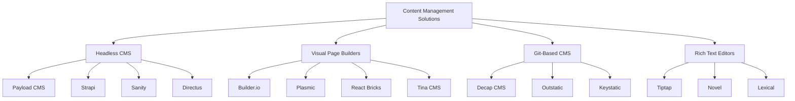

# 🎨 Complete CMS & WYSIWYG Editor Solutions for Next.js (2026)
## Comprehensive Guide to Adding Posts & Visual Editing

> **Mission**: Empower you to add, edit, and manage content with ease through visual editors and admin dashboards.

---

## 📋 Table of Contents

1. [Headless CMS Solutions (Full-Featured)](#headless-cms-solutions)
2. [Visual Page Builders (No-Code WYSIWYG)](#visual-page-builders)
3. [Lightweight Git-Based CMS](#git-based-cms)
4. [Rich Text Editors (Component-Level)](#rich-text-editors)
5. [Comparison Matrix](#comparison-matrix)
6. [Recommended Setup for Your Project](#recommended-setup)
7. [Implementation Walkthrough](#implementation-walkthrough)

---

## 🏗️ Solution Categories



---

## 🎯 CATEGORY 1: Headless CMS Solutions (Full-Featured)

### 1. **Payload CMS** ⭐ TOP RECOMMENDATION

**What It Is**: Modern, TypeScript-based headless CMS and application framework built specifically for Next.js.

#### ✅ Strengths:
- **100% TypeScript** with end-to-end type safety
- **Built-in Admin Dashboard** (beautiful, modern UI)
- **Self-Hosted & Free** (no cloud fees)
- **Code-First Configuration** (maximum control)
- **Blazing Fast Performance**
- **REST & GraphQL APIs** auto-generated
- **Rich Field Types** (blocks, arrays, relationships, upload)
- **Built-in Authentication & Access Control**
- **Live Preview** for Next.js
- **Custom React Components** in admin UI

#### ⚠️ Considerations:
- Smaller plugin ecosystem (vs. Strapi)
- Figma acquired it in 2025 (cloud hosting discontinued, self-hosting only)
- Requires Node.js backend

#### 💰 Pricing:
- **FREE** (open-source, self-hosted)
- **Cloud hosting**: Discontinued (self-host only)

#### 🚀 Use Cases:
- Complex projects with custom requirements
- Agencies building client sites
- E-commerce platforms
- SaaS applications
- High-performance content sites

#### 📦 Installation:
```bash
npx create-payload-app@latest
```

**Integration with Existing Next.js**:
```bash
npm install payload
# Configure in next.config.js
```

#### 🔗 Resources:
- Website: [payloadcms.com](https://payloadcms.com)
- Docs: [payloadcms.com/docs](https://payloadcms.com/docs)
- GitHub: [github.com/payloadcms/payload](https://github.com/payloadcms/payload)

---

### 2. **Strapi** 🔥 MOST POPULAR

**What It Is**: Leading open-source headless CMS with the largest ecosystem and plugin marketplace.

#### ✅ Strengths:
- **Massive Plugin Ecosystem** (350+ plugins)
- **Visual Content-Type Builder** (drag & drop)
- **REST & GraphQL APIs** auto-generated
- **Mature & Battle-Tested** (10+ years)
- **User-Friendly Admin Panel**
- **Media Library** with asset management
- **Role-Based Access Control**
- **Strong Community Support**
- **Easy to Learn** for non-developers

#### ⚠️ Considerations:
- Can be slower with very large datasets
- Less TypeScript-native than Payload
- Larger footprint (more dependencies)

#### 💰 Pricing:
- **FREE** (self-hosted)
- **Cloud**: Starting at $29/month

#### 🚀 Use Cases:
- Multi-author blogs
- Corporate websites
- Marketing sites
- E-commerce catalogs
- Projects needing extensive plugins

#### 📦 Installation:
```bash
npx create-strapi-app@latest my-project
```

**Next.js Integration**:
```bash
npm install axios # or any HTTP client
# Fetch data from Strapi API in Next.js
```

#### 🔗 Resources:
- Website: [strapi.io](https://strapi.io)
- Docs: [docs.strapi.io](https://docs.strapi.io)
- Marketplace: [market.strapi.io](https://market.strapi.io)

---

### 3. **Sanity** 💎 PREMIUM EXPERIENCE

**What It Is**: Modern content platform with real-time collaboration and superior developer experience.

#### ✅ Strengths:
- **Real-Time Collaboration** (like Google Docs)
- **Portable Text** (structured rich text)
- **GROQ Query Language** (powerful querying)
- **Sanity Studio** (customizable React-based UI)
- **Instant Live Preview** with Next.js
- **CDN-Hosted APIs** (blazing fast)
- **Excellent TypeScript Support**
- **Version Control** for content
- **Asset Pipeline** (image optimization)

#### ⚠️ Considerations:
- Learning curve for GROQ
- Cloud-only (no self-hosting on free plan)
- Free tier limits (3 users, 10k documents)

#### 💰 Pricing:
- **FREE** tier (3 users, 10k docs, 5GB assets)
- **Growth**: $99/month
- **Team**: $249/month

#### 🚀 Use Cases:
- Editorial workflows
- Multi-channel publishing
- Real-time content updates
- Image-heavy sites
- Collaborative teams

#### 📦 Installation:
```bash
npm create sanity@latest
```

**Next.js Integration**:
```bash
npm install next-sanity @sanity/image-url
```

#### 🔗 Resources:
- Website: [sanity.io](https://www.sanity.io)
- Docs: [sanity.io/docs](https://www.sanity.io/docs)
- Starter: [sanity.io/templates/next-js-landing-pages](https://www.sanity.io/templates/next-js-landing-pages)

---

### 4. **Directus** 🗄️ DATABASE-FIRST

**What It Is**: Data-first headless CMS that wraps any SQL database with an API and admin UI.

#### ✅ Strengths:
- **Bring Your Own Database** (PostgreSQL, MySQL, SQLite, etc.)
- **Full Self-Hosting** control
- **No Vendor Lock-In** (data stays in your DB)
- **Powerful Admin UI**
- **REST & GraphQL APIs**
- **Flows** (automation & webhooks)
- **File Storage** (local or cloud)
- **Open Data Model** (direct DB access)

#### ⚠️ Considerations:
- Requires database management skills
- More complex setup than others
- Heavier resource usage

#### 💰 Pricing:
- **FREE** (self-hosted)
- **Cloud**: Starting at $15/month

#### 🚀 Use Cases:
- Legacy database modernization
- Data-heavy applications
- Multi-database projects
- Organizations requiring full data control

#### 📦 Installation:
```bash
npx create-directus-project@latest my-project
```

#### 🔗 Resources:
- Website: [directus.io](https://directus.io)
- Docs: [docs.directus.io](https://docs.directus.io)

---

### 5. **Cromwell CMS** 🛒 E-COMMERCE FOCUSED

**What It Is**: Free, open-source TypeScript CMS built for Next.js with e-commerce features.

#### ✅ Strengths:
- **Built for E-Commerce**
- **Extensive Admin Panel**
- **No Coding Required** for editors
- **Plugin & Theme System**
- **TypeScript Native**
- **Next.js Optimized**
- **100% Free**

#### ⚠️ Considerations:
- Smaller community
- Less documentation than competitors
- Newer platform (less proven)

#### 💰 Pricing:
- **FREE** (fully open-source)

#### 🚀 Use Cases:
- Online stores
- Product catalogs
- E-commerce startups

#### 🔗 Resources:
- Website: [cromwellcms.com](https://cromwellcms.com)
- GitHub: [github.com/CromwellCMS/Cromwell](https://github.com/CromwellCMS/Cromwell)

---

## 🎨 CATEGORY 2: Visual Page Builders (No-Code WYSIWYG)

### 1. **Builder.io** 🚀 AI-POWERED

**What It Is**: Visual drag-and-drop page builder with AI capabilities for Next.js.

#### ✅ Strengths:
- **Drag & Drop** visual editor
- **AI Design Generation** (Figma to code)
- **Component Mapping** (use your React components)
- **A/B Testing** built-in
- **Personalization** engine
- **Heatmaps & Analytics**
- **Visual Copilot** (AI assistant)
- **Next.js SDK** (official support)
- **Marketing-Friendly** (no dev needed for changes)

#### ⚠️ Considerations:
- Cloud-only (no self-hosting)
- Can get expensive at scale
- Requires component registration

#### 💰 Pricing:
- **FREE** tier (up to 1,000 visitors/month)
- **Growth**: $29/month (50k visitors)
- **Business**: Custom pricing

#### 🚀 Use Cases:
- Landing pages
- Marketing campaigns
- A/B testing
- High-velocity marketing teams

#### 📦 Installation:
```bash
npm install @builder.io/react
```

#### 🔗 Resources:
- Website: [builder.io](https://www.builder.io)
- Docs: [builder.io/c/docs](https://www.builder.io/c/docs)
- Next.js Guide: [builder.io/c/docs/developers/frameworks/nextjs](https://www.builder.io/c/docs/developers/frameworks/nextjs)

---

### 2. **Plasmic** 🎯 NEXT-GEN

**What It Is**: Next-generation visual page builder and headless CMS purpose-built for Next.js.

#### ✅ Strengths:
- **True WYSIWYG** (pixel-perfect)
- **No-Code for Designers**
- **Code Components** (integrate React components)
- **CMS Built-In** (no separate backend needed)
- **Version Control** for designs
- **Responsive Editing**
- **Clean Code Export**
- **Design System Support**
- **FREE for Unlimited Projects**

#### ⚠️ Considerations:
- Learning curve for advanced features
- Cloud-hosted only
- Component integration requires setup

#### 💰 Pricing:
- **FREE** (unlimited projects, viewers)
- **Growth**: $40/month (team features)
- **Enterprise**: Custom

#### 🚀 Use Cases:
- Design-to-code workflows
- Agency client projects
- Marketing landing pages
- Design system implementation

#### 📦 Installation:
```bash
npm install @plasmicapp/loader-nextjs
```

#### 🔗 Resources:
- Website: [plasmic.app](https://www.plasmic.app)
- Docs: [docs.plasmic.app](https://docs.plasmic.app)
- Next.js Integration: [docs.plasmic.app/learn/nextjs-quickstart](https://docs.plasmic.app/learn/nextjs-quickstart)

---

### 3. **React Bricks** 🧱 COMPONENT-BASED

**What It Is**: Visual CMS with inline editing using React components as "bricks."

#### ✅ Strengths:
- **Inline Visual Editing** (edit on the page)
- **React Components** as content blocks
- **Brand Consistency** (component library approach)
- **Developer-Friendly** (code-first)
- **Live Preview**
- **Image Optimization** built-in
- **SEO-Friendly**
- **Next.js First-Class Support**

#### ⚠️ Considerations:
- Smaller ecosystem
- Requires building custom bricks
- Cloud-hosted only

#### 💰 Pricing:
- **FREE** (1 user, 100 pages)
- **Starter**: $100/month (3 users, 500 pages)
- **Pro**: $300/month

#### 🚀 Use Cases:
- Corporate websites
- Marketing sites with brand guidelines
- Developer-led content projects

#### 📦 Installation:
```bash
npx create-react-bricks-app
```

#### 🔗 Resources:
- Website: [reactbricks.com](https://www.reactbricks.com)
- Docs: [docs.reactbricks.com](https://docs.reactbricks.com)

---

### 4. **Tina CMS** 📝 GIT-POWERED

**What It Is**: Open-source, Git-backed headless CMS with visual editing for Next.js.

#### ✅ Strengths:
- **Open-Source** (fully free to self-host)
- **Git-Based** (content in your repo)
- **Visual WYSIWYG Editor**
- **Real-Time Editing**
- **Next.js Native** (built for it)
- **TypeScript Support**
- **MDX Support** (Markdown + JSX)
- **Local Development** (edit offline)
- **Version Control** (via Git)

#### ⚠️ Considerations:
- Git workflow can be complex for non-devs
- Cloud tier needed for non-technical editors
- Limited to file-based content

#### 💰 Pricing:
- **FREE** (self-hosted, unlimited)
- **Cloud**: $29/month (2 users)
- **Business**: Custom

#### 🚀 Use Cases:
- Blogs
- Documentation sites
- Developer-focused content
- Markdown-based sites

#### 📦 Installation:
```bash
npx create-tina-app@latest
```

#### 🔗 Resources:
- Website: [tina.io](https://tina.io)
- Docs: [tina.io/docs](https://tina.io/docs)
- Next.js Guide: [tina.io/docs/frameworks/next](https://tina.io/docs/frameworks/next)

---

## 📁 CATEGORY 3: Lightweight Git-Based CMS

### 1. **Decap CMS** (formerly Netlify CMS) 📄

**What It Is**: Open-source, Git-based CMS with a friendly UI for static sites.

#### ✅ Strengths:
- **100% Free** & open-source
- **Git Workflow** (commits as saves)
- **Easy Setup** (single config file)
- **Platform Agnostic**
- **Editorial Workflow** (draft → review → publish)
- **Media Management**
- **Custom Widgets** support

#### ⚠️ Considerations:
- Limited to static/file-based content
- Requires auth setup for self-hosting
- Less active development (post-Netlify)
- No real-time collaboration

#### 💰 Pricing:
- **FREE** (100% open-source)

#### 🚀 Use Cases:
- Blogs
- Documentation
- Simple marketing sites
- Static site generators

#### 📦 Installation:
```bash
npm install decap-cms-app
# Add admin/config.yml configuration
```

#### 🔗 Resources:
- Website: [decapcms.org](https://decapcms.org)
- Docs: [decapcms.org/docs](https://decapcms.org/docs)

---

### 2. **Outstatic** 🌟 GITHUB-NATIVE

**What It Is**: Git-based CMS built with Next.js, stores content in your GitHub repo.

#### ✅ Strengths:
- **Built for Next.js** (native App Router support)
- **GitHub Storage** (free hosting)
- **Simple Setup** (5 minutes)
- **Markdown & MDX**
- **Image Uploads** (to GitHub)
- **Custom Collections**
- **100% Free**
- **No Backend Needed**

#### ⚠️ Considerations:
- GitHub-only (no GitLab/Bitbucket)
- Basic editor (no advanced WYSIWYG)
- Limited to Markdown content

#### 💰 Pricing:
- **FREE** (fully open-source)

#### 🚀 Use Cases:
- Personal blogs
- Portfolio sites
- Documentation
- GitHub-first workflows

#### 📦 Installation:
```bash
npx outstatic init
```

#### 🔗 Resources:
- Website: [outstatic.com](https://outstatic.com)
- Docs: [outstatic.com/docs](https://outstatic.com/docs)
- GitHub: [github.com/avitorio/outstatic](https://github.com/avitorio/outstatic)

---

### 3. **Keystatic** 🔑 BY THINKMILL

**What It Is**: Modern Git-based CMS with local-first editing and cloud sync.

#### ✅ Strengths:
- **Local-First** (edit without internet)
- **Git-Backed** (version control)
- **Beautiful UI** (modern design)
- **TypeScript Native**
- **MDX Support**
- **Component Fields** (structured content)
- **Next.js Compatible**
- **Open-Source**

#### ⚠️ Considerations:
- Relatively new (smaller community)
- Git workflow complexity
- Limited documentation

#### 💰 Pricing:
- **FREE** (open-source)

#### 🚀 Use Cases:
- Content-heavy sites
- Multi-author blogs
- Documentation platforms

#### 🔗 Resources:
- Website: [keystatic.com](https://keystatic.com)
- Docs: [keystatic.com/docs](https://keystatic.com/docs)

---

## ✍️ CATEGORY 4: Rich Text Editors (Component-Level)

### 1. **Tiptap** 🎨 HEADLESS WYSIWYG

**What It Is**: Headless, extensible rich-text editor framework for React.

#### ✅ Strengths:
- **Fully Customizable** (headless approach)
- **Real-Time Collaboration** (with extensions)
- **Markdown Support**
- **Slash Commands**
- **Extensible** (custom nodes/marks)
- **TypeScript Native**
- **ProseMirror-Based** (powerful)
- **Active Development**

#### ⚠️ Considerations:
- Requires custom UI development
- Steeper learning curve
- Not a full CMS (just an editor)

#### 💰 Pricing:
- **FREE** (open-source)
- **Cloud/Collaboration**: Paid add-ons

#### 📦 Installation:
```bash
npm install @tiptap/react @tiptap/starter-kit
```

#### 🔗 Resources:
- Website: [tiptap.dev](https://tiptap.dev)
- Docs: [tiptap.dev/docs](https://tiptap.dev/docs)
- Examples: [tiptap.dev/examples](https://tiptap.dev/examples)

---

### 2. **Novel** 📖 NOTION-STYLE

**What It Is**: Notion-style WYSIWYG editor built with Tiptap for Next.js.

#### ✅ Strengths:
- **Beautiful UI** (Notion-like)
- **Out-of-the-Box** (ready to use)
- **Slash Commands**
- **Bubble Menu**
- **AI Integration** (optional)
- **Image Uploads**
- **Tailwind CSS**
- **Next.js Optimized**

#### ⚠️ Considerations:
- Opinionated design (less customizable)
- Not a full CMS (just editor component)

#### 💰 Pricing:
- **FREE** (open-source)

#### 📦 Installation:
```bash
npm install novel
```

#### 🔗 Resources:
- GitHub: [github.com/steven-tey/novel](https://github.com/steven-tey/novel)
- Demo: [novel.sh](https://novel.sh)

---

### 3. **Lexical** ⚛️ META'S EDITOR

**What It Is**: Extensible text editor framework by Meta (Facebook).

#### ✅ Strengths:
- **Backed by Meta** (Facebook, Instagram use it)
- **Highly Performant**
- **Framework Agnostic**
- **React Support** (first-class)
- **Plugin System**
- **Accessibility** (built-in)
- **Collaboration** support
- **TypeScript Native**

#### ⚠️ Considerations:
- Requires significant setup
- Less community resources (vs. Tiptap)
- Documentation can be sparse

#### 💰 Pricing:
- **FREE** (open-source)

#### 📦 Installation:
```bash
npm install lexical @lexical/react
```

#### 🔗 Resources:
- Website: [lexical.dev](https://lexical.dev)
- Docs: [lexical.dev/docs/intro](https://lexical.dev/docs/intro)
- Playground: [lexical.dev/playground](https://lexical.dev/playground)

---

### 4. **Plate** 🍽️ PLUGIN-RICH

**What It Is**: Rich-text editor with 50+ plugins for React.

#### ✅ Strengths:
- **50+ Plugins** (tables, mentions, code, etc.)
- **Highly Customizable**
- **TypeScript Native**
- **Component Library** included
- **Radix UI** based
- **Slate.js** foundation
- **Great Documentation**

#### ⚠️ Considerations:
- Large bundle size (with all plugins)
- Complex API for advanced features

#### 💰 Pricing:
- **FREE** (open-source)
- **Plate Plus**: $10/month (premium plugins)

#### 📦 Installation:
```bash
npm install @udecode/plate
```

#### 🔗 Resources:
- Website: [platejs.org](https://platejs.org)
- Docs: [platejs.org/docs](https://platejs.org/docs)

---

## 📊 Comparison Matrix

| Solution | Type | Self-Host | Cost | WYSIWYG | Ease of Use | Best For |
|----------|------|-----------|------|---------|-------------|----------|
| **Payload CMS** | Headless CMS | ✅ Yes | 🆓 Free | ✅ Yes | ⭐⭐⭐⭐ | Complex projects, agencies |
| **Strapi** | Headless CMS | ✅ Yes | 🆓 Free | ✅ Yes | ⭐⭐⭐⭐⭐ | General-purpose, plugins |
| **Sanity** | Headless CMS | ⚠️ Limited | 🆓 Free tier | ✅ Yes | ⭐⭐⭐⭐ | Real-time collaboration |
| **Directus** | Headless CMS | ✅ Yes | 🆓 Free | ✅ Yes | ⭐⭐⭐ | Database-first projects |
| **Builder.io** | Page Builder | ❌ No | 🆓 Free tier | ✅✅ Excellent | ⭐⭐⭐⭐ | Marketing teams |
| **Plasmic** | Page Builder | ❌ No | 🆓 Free | ✅✅ Excellent | ⭐⭐⭐⭐ | Design-to-code |
| **React Bricks** | Page Builder | ❌ No | 💰 $100/mo | ✅✅ Excellent | ⭐⭐⭐⭐ | Component-driven |
| **Tina CMS** | Git CMS | ✅ Yes | 🆓 Free | ✅ Yes | ⭐⭐⭐ | Blogs, docs |
| **Decap CMS** | Git CMS | ✅ Yes | 🆓 Free | ⚠️ Basic | ⭐⭐⭐ | Static sites |
| **Outstatic** | Git CMS | ✅ Yes | 🆓 Free | ⚠️ Basic | ⭐⭐⭐⭐ | GitHub-native blogs |
| **Tiptap** | Editor | N/A | 🆓 Free | ✅ Custom | ⭐⭐⭐ | Developers |
| **Novel** | Editor | N/A | 🆓 Free | ✅ Yes | ⭐⭐⭐⭐⭐ | Quick setup |
| **Lexical** | Editor | N/A | 🆓 Free | ✅ Custom | ⭐⭐ | Advanced needs |

---

## 🎯 Recommended Setup for Your Project

Based on your Next.js project (`ai-authority-vortex`), here are my **top 3 recommendations**:

### 🥇 **Option 1: Payload CMS** (Best Overall)

**Why**: 
- Built specifically for Next.js
- 100% free, self-hosted
- Beautiful admin dashboard out-of-the-box
- TypeScript native (matches your stack)
- Can handle everything (blog posts, pages, media, etc.)

**What You Get**:
- Admin UI at `/admin`
- REST & GraphQL APIs
- Media management
- WYSIWYG editor for rich content
- User authentication
- Custom collections (posts, pages, etc.)

**Setup Time**: ~30 minutes

---

### 🥈 **Option 2: Tina CMS** (Git-Based + Visual)

**Why**:
- Free & open-source
- Visual WYSIWYG editing
- Content stored in Git (version control)
- No separate backend needed
- Great for blogs/content sites

**What You Get**:
- Visual editor
- MDX support
- Git-backed content
- Local editing
- Media handling

**Setup Time**: ~20 minutes

---

### 🥉 **Option 3: Builder.io + Novel** (Hybrid)

**Why**:
- Visual page builder (Builder.io) for landing pages
- Rich text editor (Novel) for blog posts
- Best of both worlds
- Marketing-friendly

**What You Get**:
- Drag & drop pages (Builder.io)
- Beautiful rich text editor (Novel)
- Flexible approach

**Setup Time**: ~45 minutes

---

## 🛠️ Implementation Walkthrough

### Quick Start: Payload CMS (Recommended)

#### **Step 1: Install Payload**
```bash
cd C:\IDE-PROJECTS\ANTIGRAVITY\New folder\ai-authority-vortex
npm install payload @payloadcms/db-mongodb @payloadcms/richtext-lexical
```

#### **Step 2: Create Payload Config**
Create `payload.config.ts` in your project root:

```typescript
import { buildConfig } from 'payload/config'
import { mongooseAdapter } from '@payloadcms/db-mongodb'
import { lexicalEditor } from '@payloadcms/richtext-lexical'

export default buildConfig({
  serverURL: process.env.NEXT_PUBLIC_SERVER_URL || 'http://localhost:3000',
  admin: {
    user: 'users',
  },
  editor: lexicalEditor({}),
  collections: [
    {
      slug: 'posts',
      admin: {
        useAsTitle: 'title',
      },
      fields: [
        {
          name: 'title',
          type: 'text',
          required: true,
        },
        {
          name: 'content',
          type: 'richText',
          required: true,
        },
        {
          name: 'slug',
          type: 'text',
          required: true,
        },
        {
          name: 'publishedAt',
          type: 'date',
        },
        {
          name: 'featuredImage',
          type: 'upload',
          relationTo: 'media',
        },
      ],
    },
    {
      slug: 'media',
      upload: {
        staticDir: 'media',
        imageSizes: [
          {
            name: 'thumbnail',
            width: 400,
            height: 300,
            position: 'centre',
          },
          {
            name: 'card',
            width: 768,
            height: 1024,
            position: 'centre',
          },
        ],
      },
      fields: [
        {
          name: 'alt',
          type: 'text',
        },
      ],
    },
    {
      slug: 'users',
      auth: true,
      fields: [],
    },
  ],
  db: mongooseAdapter({
    url: process.env.DATABASE_URI || 'mongodb://localhost/your-database-name',
  }),
  typescript: {
    outputFile: './payload-types.ts',
  },
})
```

#### **Step 3: Update `next.config.mjs`**
```javascript
import { withPayload } from '@payloadcms/next/withPayload'

/** @type {import('next').NextConfig} */
const nextConfig = {
  // Your existing config
}

export default withPayload(nextConfig)
```

#### **Step 4: Create Admin Route**
Create `src/app/(payload)/admin/[[...segments]]/page.tsx`:
```typescript
import { RootLayout, RootPage } from '@payloadcms/next/layouts'
import { importMap } from '../importMap'
import config from '@/payload.config'
import '@payloadcms/next/css'

type Args = {
  params: {
    segments: string[]
  }
  searchParams: { [key: string]: string | string[] }
}

const Page = ({ params, searchParams }: Args) => (
  <RootPage
    config={config}
    importMap={importMap}
    params={params}
    searchParams={searchParams}
  />
)

export default Page
```

#### **Step 5: Add Environment Variables**
Create/update `.env.local`:
```env
DATABASE_URI=mongodb://localhost:27017/ai-authority-vortex
PAYLOAD_SECRET=your-secret-key-here
NEXT_PUBLIC_SERVER_URL=http://localhost:3000
```

#### **Step 6: Run Your App**
```bash
npm run dev
```

#### **Step 7: Access Admin**
Navigate to: `http://localhost:3000/admin`

Create your first user and start adding content!

---

### Alternative: Outstatic (Simplest Setup)

If you want the SIMPLEST option with zero backend:

#### **Step 1: Install**
```bash
npx outstatic init
```

#### **Step 2: Follow Prompts**
- Connect GitHub account
- Configure collections
- Done!

#### **Step 3: Access Admin**
Navigate to: `http://localhost:3000/outstatic`

---

## 🚀 Next Steps

1. **Choose Your Solution** based on your needs:
   - **Full Control + Features**: Payload CMS
   - **Simplest Setup**: Outstatic
   - **Marketing Focus**: Builder.io
   - **Git Workflow**: Tina CMS

2. **Install & Configure** using the guides above

3. **Create Content Collections**:
   - Blog posts
   - Pages
   - Services
   - Team members
   - Testimonials

4. **Build Frontend Components** to display content

5. **Deploy**:
   - Frontend: Vercel/Netlify
   - Backend (if needed): Railway/Render/DigitalOcean

---

## 🎓 Pro Tips

1. **Start Simple**: Begin with a basic setup, expand later
2. **Content Modeling**: Plan your content structure before building
3. **Media Strategy**: Use CDN (Cloudinary/Uploadcare) for images
4. **SEO**: Ensure your CMS supports meta fields
5. **Preview Mode**: Implement draft previews for editors
6. **Backup**: Always backup content (especially with Git-based)
7. **Access Control**: Set up proper roles/permissions
8. **API Keys**: Secure your API endpoints
9. **Caching**: Implement caching for production
10. **Documentation**: Document your content model for editors

---

## 📚 Additional Resources

### Learning Paths:
- [Payload CMS Crash Course](https://www.youtube.com/results?search_query=payload+cms+tutorial)
- [Next.js + Headless CMS Guide](https://nextjs.org/docs/basic-features/data-fetching)
- [Tina CMS + Next.js](https://tina.io/docs/frameworks/next/)

### Community:
- [Payload Discord](https://discord.gg/payload)
- [Strapi Discord](https://discord.strapi.io)
- [Next.js Discord](https://nextjs.org/discord)

---

## ✅ Summary Table: Quick Decision Guide

| If You Need... | Choose This |
|----------------|-------------|
| **Full-featured CMS with admin UI** | Payload CMS or Strapi |
| **Visual drag & drop page builder** | Builder.io or Plasmic |
| **Simplest setup (no backend)** | Outstatic or Decap CMS |
| **Git-based workflow** | Tina CMS or Keystatic |
| **Real-time collaboration** | Sanity or Tina CMS Cloud |
| **E-commerce focus** | Cromwell CMS or Payload |
| **Just a rich text editor** | Novel or Tiptap |
| **Maximum customization** | Payload CMS or Directus |
| **Best for beginners** | Strapi or Outstatic |
| **Best for developers** | Payload CMS or Sanity |
| **Best for marketers** | Builder.io or Storyblok |
| **100% free forever** | Payload, Strapi, Tina (self-hosted) |

---

**Ready to implement? Let me know which solution you'd like to set up, and I'll provide a detailed, step-by-step implementation plan specifically for your `ai-authority-vortex` project!**

🚀 **APEX MODE: Content Management Unlocked**
