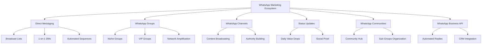

# 🚀 WhatsApp Marketing Warfare Strategy (2026)
## Advanced Client Acquisition Framework

> **Mission**: Deploy a multi-channel WhatsApp ecosystem to acquire clients fast, effectively, and naturally through strategic relationship-building and value delivery.

---

## 📊 Strategic Overview

### The WhatsApp Marketing Matrix


---

## 🎯 STRATEGY 1: Advanced Broadcast Messaging (Direct to Contacts)

### A. Contact Segmentation Framework

#### Tier 1: Hot Contacts (Ready to Buy)
- Previous clients
- Referred contacts
- Active engagers from groups

#### Tier 2: Warm Contacts (Aware & Interested)
- Network connections
- Event contacts
- Industry peers

#### Tier 3: Cold Contacts (Awareness Stage)
- Dormant contacts
- Old contacts
- Passive connections

---

### B. Message Arsenal (12 High-Converting Templates)

#### **Template 1: The "Value Bomb" Opener**
```
Hey [Name]! 🚀

Just dropped a game-changing insight:

[Your AI Authority Service] helped [Client Name] achieve [Specific Result] in [Timeframe].

The secret? [One powerful insight/method]

Want the full breakdown? It's 100% free.

Reply "YES" if interested.

P.S. This worked for [industry/niche] - thought of you immediately.
```

#### **Template 2: The "Case Study Tease"**
```
[Name], quick question -

Are you currently struggling with [specific pain point in their industry]?

We just cracked the code for [Company Name] and the results are insane:
• [Metric 1]
• [Metric 2]
• [Metric 3]

I recorded a 5-min breakdown. Want me to send it over?
```

#### **Template 3: The "Exclusive Invite"**
```
🔥 [Name] - VIP Access Only

I'm opening up 5 slots for a FREE [AI Strategy Audit / Consultation Call] this week.

What you'll get:
✓ Custom AI implementation roadmap
✓ ROI projection for your business
✓ Competitor gap analysis

Usually $500. Yours free if you book in the next 48h.

Interested? Reply "BOOK" and I'll send the calendar link.
```

#### **Template 4: The "Social Proof Tsunami"**
```
[Name], this is wild 🤯

In the last 30 days:
• Helped [Client A] automate 70% of their workflow
• [Client B] increased revenue by 40%
• [Client C] cut costs by $10K/month

All using AI strategies most people ignore.

I'm documenting the exact playbook. Want early access?
```

#### **Template 5: The "Pain Point Agitator"**
```
[Name], brutal truth:

95% of [their industry] businesses are leaving money on the table because they're not using AI properly.

The ones who get it? They're scaling 3x faster.

I put together a 10-minute workshop that breaks down:
→ The #1 AI mistake killing growth
→ The 3 tools your competitors are using
→ How to implement THIS WEEK

Drop a "🔥" if you want the link.
```

#### **Template 6: The "Resource Gift"**
```
Hey [Name]! 🎁

No pitch, just value:

I created a [free resource/checklist/template] for [their industry] that covers:
• [Benefit 1]
• [Benefit 2]
• [Benefit 3]

Thought it might help you with [specific challenge].

Want me to send it over? Completely free.
```

#### **Template 7: The "FOMO Trigger"**
```
[Name] - heads up 🚨

We're launching [new service/offer] next week and it's going to be HIGHLY limited.

Early birds get:
→ [Bonus 1]
→ [Bonus 2]
→ [Special pricing]

I can add you to the waitlist if you're interested. Spots are filling fast.

In or out?
```

#### **Template 8: The "Authority Flex"**
```
[Name], exciting news 📰

Just got featured in [publication/podcast/event] talking about [topic relevant to them].

One thing I mentioned: [key insight that solves their problem]

If you're dealing with [their pain point], this could be a game-changer.

Want the full interview? I'll send you the link.
```

#### **Template 9: The "Personal Connection"**
```
Hey [Name],

It's been a while! Hope [personal detail about them] is going great.

Quick reason for reaching out:

I'm working on something in the [AI/automation] space and immediately thought of you because of your work in [their field].

Would love to get your thoughts over a quick call. 

Free this week?
```

#### **Template 10: The "Survey Hook"**
```
[Name], need your brain for 60 seconds 🧠

Running a quick survey for [their industry] leaders:

What's your #1 challenge with [specific problem] right now?

A) [Option 1]
B) [Option 2]
C) [Option 3]
D) Something else (reply with it)

Will share the insights + solution guide with everyone who responds.
```

#### **Template 11: The "Behind-the-Scenes"**
```
[Name], this is BTS 🎬

Currently building [new product/service/feature] and documenting the entire journey.

So far:
• [Milestone 1]
• [Milestone 2]
• [Preview of what's coming]

If you're into [relevant topic], you'll love following along.

Want me to add you to the updates list?
```

#### **Template 12: The "Direct CTA Close"**
```
[Name], straight to the point:

If you're serious about [achieving specific result] in 2026, we should talk.

We have a proven system that's generating [result] for businesses like yours.

I have 15 minutes open on [Day/Time]. 

Should I block it for you?

Yes or no - either way, no hard feelings 🤝
```

---

### C. Broadcast Campaign Calendar

#### Week 1: Awareness + Value
- **Monday**: Template 6 (Resource Gift)
- **Thursday**: Template 1 (Value Bomb)

#### Week 2: Authority + Social Proof
- **Tuesday**: Template 4 (Social Proof)
- **Friday**: Template 8 (Authority Flex)

#### Week 3: Engagement + Conversion
- **Monday**: Template 10 (Survey Hook)
- **Wednesday**: Template 3 (Exclusive Invite)

#### Week 4: Urgency + Close
- **Tuesday**: Template 7 (FOMO)
- **Thursday**: Template 12 (Direct CTA)

> **CRITICAL RULE**: Never send more than 2 messages per week to the same contact. Space them 3-4 days apart.

---

## 🎯 STRATEGY 2: WhatsApp Groups Domination

### A. Group Architecture

#### 1. **Create Your Own Groups** (Authority Building)

**Group 1: "AI Authority Insiders"** (VIP Group)
- **Size**: 50-100 max
- **Entry**: Application only
- **Content**: Premium insights, live Q&As, case studies
- **Activity**: 3-5 posts per week
- **Conversion**: Soft sell through value demonstration

**Group 2: "[Your Industry] AI Growth Tribe"** (Community Group)
- **Size**: 200-500
- **Entry**: Open with screening question
- **Content**: Daily tips, member wins, resource shares
- **Activity**: Daily engagement
- **Conversion**: Funnel to VIP group or 1-on-1 calls

**Group 3: "Free AI Tools & Hacks"** (Lead Magnet Group)
- **Size**: Unlimited
- **Entry**: Open
- **Content**: Curated tools, tutorials, trends
- **Activity**: 2-3 posts per week
- **Conversion**: Nurture to Community Group

---

#### 2. **Join & Dominate Existing Groups** (Network Expansion)

**The "Value Bomb" Method**:

1. **Join 10-20 industry-relevant groups**
2. **Spend 2 weeks observing** (don't post immediately)
3. **Identify pain patterns** (what people ask about repeatedly)
4. **Provide 10x value responses**:
   ```
   "Great question [Name]! 
   
   Here's what worked for us:
   [Detailed, actionable answer]
   
   If you want the full framework, I created a [free resource]. 
   Happy to share - just DM me."
   ```

5. **DM everyone who engages** with your answers
6. **Establish authority** by being the most helpful person
7. **Soft funnel** to your own groups or services

**Weekly Group Engagement Plan**:
- **Monday**: Answer 5 questions with value
- **Wednesday**: Share a case study or win
- **Friday**: Drop a free resource or tool

---

### B. Group Messaging Scripts

#### **New Member Welcome (Auto-DM)**
```
Hey [Name]! 👋

Welcome to [Group Name]!

Quick intro: We're all about [group purpose].

To help you get the most value, what's your #1 goal with [topic] right now?

Also, here's a free [resource] to get you started: [link]

Looking forward to connecting!
```

#### **Group Post Template: Daily Value**
```
🔥 Quick Win for Today:

[30-second actionable tip related to AI/your niche]

Pro Tip: [Advanced insight]

Try this and let me know your results! 👇

---
P.S. If you want the full breakdown on [related topic], I created a free guide. Comment "SEND" and I'll DM you the link.
```

#### **Group Post Template: Case Study**
```
📊 RESULTS ALERT

Client: [Industry/Type]
Challenge: [Problem]
Solution: [Your approach]
Results: 
• [Metric 1]
• [Metric 2]
• [Metric 3]

Time: [Timeframe]

The best part? This is 100% replicable.

DM me "BREAKDOWN" if you want to see how we did it.
```

---

## 🎯 STRATEGY 3: WhatsApp Channels (New Power Move)

> **Note**: WhatsApp Channels are one-way broadcast tools. Perfect for authority building.

### A. Channel Setup

**Channel Name**: "[Your Brand] AI Insider"

**Description**: 
```
🚀 Daily AI strategies, tools & case studies
🎯 For entrepreneurs who want to leverage AI to scale
💡 No fluff. Pure execution.

Join 1,000+ founders getting ahead.
```

### B. Content Strategy

#### Daily Content Themes:
- **Monday**: "Motivation Monday" - Wins & testimonials
- **Tuesday**: "Tool Tuesday" - AI tool breakdown
- **Wednesday**: "Wisdom Wednesday" - Strategy deep-dive
- **Thursday**: "Throwback Thursday" - Case study replay
- **Friday**: "Free Friday" - Resource drop
- **Saturday**: "Stat Saturday" - Industry insights
- **Sunday**: "Q&A Sunday" - Answer common questions

#### Channel Post Templates:

**Template: Tool Drop**
```
🛠️ TOOL OF THE DAY

Name: [Tool]
Use Case: [What it does]
Why It Matters: [Impact]
Cost: [Free/Paid]

Best Feature: [Highlight]

Try it here: [Link]

---
💬 Using this already? Share your experience in the comments!
```

**Template: Quick Tip**
```
⚡ 60-SECOND TIP

Want to [achieve result]?

Do this:
1. [Step 1]
2. [Step 2]
3. [Step 3]

That's it. Simple but deadly effective.

---
Save this. You'll need it.
```

**Template: Social Proof**
```
📈 CLIENT WIN

[Client Name/Industry] just hit:
→ [Result 1]
→ [Result 2]
→ [Result 3]

Using: [Your method/service]

Timeline: [X days/weeks]

This is what's possible when you [key insight].

---
Want similar results? Link in bio or DM me "RESULTS"
```

### C. Channel Growth Hacks

1. **Cross-promote in Groups**: "For daily tips, join our Channel: [link]"
2. **Status Updates**: Promote channel link weekly
3. **DM Signatures**: Add channel link to every message
4. **Exclusive Content**: Tease premium content available only on channel

---

## 🎯 STRATEGY 4: Status Updates (24-Hour Visibility Bombs)

### Daily Status Strategy

#### Morning Status (7-9 AM)
```
☕ Morning Insight:

[One powerful quote or tip]

[Brief context or story]

Screenshot this before it disappears 📸
```

#### Afternoon Status (12-2 PM)
```
🔥 Behind the Scenes:

Currently [working on project/with client]

Sneak peek: [Image/result]

This is going to be [exciting outcome]...

DM me "CURIOUS" if you want updates
```

#### Evening Status (6-8 PM)
```
💡 Today's Win:

[Share a client result, personal milestone, or learning]

Key Takeaway: [One lesson]

Tomorrow: [Tease next day's content]
```

### Status Content Mix (Weekly)
- **40%**: Value tips & insights
- **30%**: Behind-the-scenes / Personal brand
- **20%**: Social proof & wins
- **10%**: Direct CTAs

---

## 🎯 STRATEGY 5: WhatsApp Communities (Meta-Structure)

### Community Architecture

**Your Community**: "[Your Brand] AI Ecosystem"

**Structure**:
```
📱 Main Announcement Channel (Read-only)
    ↓
🔹 Sub-Group 1: Beginners Hub
🔹 Sub-Group 2: Advanced Implementers
🔹 Sub-Group 3: Agency Owners
🔹 Sub-Group 4: E-commerce AI
```

**Benefits**:
- Centralized audience management
- Segmented value delivery
- Cross-pollination between groups
- Authority consolidation

---

## 🎯 STRATEGY 6: WhatsApp Business Features

### A. Business Profile Optimization

**Profile Name**: [Your Brand/Name]

**Description**:
```
🚀 AI Implementation Specialist
💼 Helping [target audience] achieve [result]
📊 [X] clients served | [X]% avg growth

📞 Free Strategy Call: [Link]
🎁 Free Resources: [Link]
```

**Catalog**: Showcase your services with:
- Service name
- Description
- Price (or "Custom Quote")
- Sample results/image

### B. Automated Tools

**Quick Replies** (Save these):
- `/intro` = Your introduction message
- `/booking` = Calendar link
- `/case` = Case study link
- `/pricing` = Pricing info
- `/free` = Free resource link

**Away Message**:
```
Thanks for reaching out! 🙌

I'm currently [away/in a meeting] but will respond within [timeframe].

Meanwhile:
🎁 Grab our free [resource]: [link]
📅 Book a call: [link]

- [Your Name]
```

**Greeting Message** (First-time contacts):
```
Hey there! 👋

Thanks for connecting. I'm [Name], and I help [target audience] achieve [result] using AI.

Quick question: What brings you here today?

A) Interested in services
B) Want free resources
C) Just exploring

Reply with A, B, or C and I'll point you in the right direction!
```

---

## 🎯 STRATEGY 7: Advanced Automation & Sequencing

### The 7-Day Nurture Sequence (For New Contacts)

**Day 1**: First contact (Template 6 - Resource Gift)
**Day 3**: Follow-up (Check if they got value)
**Day 5**: Case study share (Template 2)
**Day 7**: Soft CTA (Template 3 - Exclusive Invite)

If no response by Day 7 → Move to "Dormant" list

If engaged → Move to "Hot Lead" sequence:
- **Day 8**: Book a call
- **Day 10**: Final FOMO push
- **Day 12**: Last chance message

---

## 🎯 STRATEGY 8: Hybrid Multi-Channel Approach

### The "Omnipresence Formula"

**Week 1**:
- Day 1: DM broadcast (Template 1)
- Day 2: Status update (Insight)
- Day 3: Group value post
- Day 4: Channel content
- Day 5: Status update (Case study)
- Day 6: Group engagement
- Day 7: Channel + Status combo

**Week 2**:
- Repeat with different message templates
- Add 1-on-1 conversations with engagers
- Invite warm leads to VIP group

---

## 📊 Key Performance Indicators (KPIs)

### Track Weekly:
- **Broadcast Messages Sent**: Target 100-200
- **Open Rate**: Track via "Read" receipts (aim for 70%+)
- **Response Rate**: Target 15-25%
- **Call Bookings**: Target 5-10 per week
- **Group Growth**: +20-50 members/week
- **Channel Subscribers**: +50-100/week
- **Conversions to Clients**: Track from first touch

---

## ⚠️ Compliance & Natural Growth Principles

### DO's:
✅ Personalize every broadcast message
✅ Provide value before asking
✅ Respect response times (don't spam)
✅ Use proper formatting (emojis, spacing, bullets)
✅ Build relationships over transactions
✅ Segment your audience
✅ Use broadcast lists (not group spam)
✅ Test different message variations
✅ Respond to every reply within 2 hours

### DON'Ts:
❌ Send generic copy-paste messages
❌ Spam groups with sales pitches
❌ Add people to groups without permission
❌ Send more than 2 unsolicited messages/week
❌ Use aggressive sales language
❌ Ignore data privacy laws (GDPR, etc.)
❌ Buy contact lists
❌ Use unofficial WhatsApp mods
❌ Send messages between 9 PM - 8 AM

---

## 🔥 The 30-Day Blitz Protocol (Client Acquisition Sprint)

### Week 1: Foundation
- Set up WhatsApp Business Profile
- Create 3 groups (VIP, Community, Lead Magnet)
- Join 10 existing groups
- Create Channel
- Build broadcast lists (segment contacts)
- Set up quick replies & automation

### Week 2: Launch
- Send first broadcast (Template 6)
- Post daily in your groups
- Engage in 5 external groups daily
- Post 2x daily on Channel
- 3 Status updates per day
- DM everyone who engages

### Week 3: Amplification
- Send second broadcast (Template 4)
- Host live Q&A in VIP group
- Launch poll/survey in Community
- Share case study on Channel
- Leverage testimonials in Status
- Follow up with warm leads (1-on-1)

### Week 4: Conversion
- Send FOMO broadcast (Template 7)
- Offer exclusive limited-time deal
- Close conversations with Template 12
- Convert leads to calls
- Nurture未转化 leads into sequences
- Analyze results & optimize

### Expected Results (30 Days):
- 500-1,000 new group members
- 200-500 channel subscribers
- 50-100 qualified conversations
- 10-20 booked calls
- 5-10 new clients

---

## 🛠️ Recommended Tools

### Management:
- **WATI / Respond.io**: WhatsApp CRM & automation
- **Interakt**: Broadcast & chatbot platform
- **Trengo**: Multi-agent inbox

### Analytics:
- **Built-in WhatsApp Business Analytics**
- **Google Sheets**: Manual tracking template
- **Notion**: CRM database

### Scheduling:
- **SKEDit**: Schedule WhatsApp messages (use carefully)
- **Calendly / Cal.com**: Booking integration

### Design:
- **Canva**: Status update graphics
- **CapCut**: Video content for Status

---

## 🎓 Pro Tips from the Trenches

1. **Voice Notes > Text**: For warm leads, send 30-60 sec voice notes. Higher trust, faster rapport.

2. **The "Screenshot Share"**: Take screenshots of client results and share as images. Visual proof converts 3x better.

3. **The "Mutual Connection" Opener**: "Hey [Name], we're both connected to [Mutual Contact]. They mentioned you're doing great work in [field]..."

4. **The "Engagement Loop"**: End every message with a question or clear CTA. Never send statements without action triggers.

5. **The "Controversy Content"**: In groups, share polarizing opinions (tastefully). Drives engagement and positions you as a thought leader.

6. **The "Collaborative DM"**: "I'm creating [resource] for [industry]. Mind if I ask you 2 quick questions?" (People love being consulted)

7. **The "Referral Trigger"**: After delivering value, ask: "Know anyone else who'd benefit from this?"

8. **The "Deadline Stack"**: Limited time + Limited spots + Bonus = Maximum FOMO

9. **The "Reply Rate Hack"**: Use single-option responses: "Reply YES if you want this" → Much higher response than open questions

10. **The "Micro-Commitment Ladder"**: 
    - First ask: Small favor (e.g., feedback)
    - Second ask: Medium action (e.g., join group)
    - Third ask: Book call
    - Fourth ask: Become client

---

## 🚨 Common Mistakes to Avoid

1. **Broadcasting Without Segmentation**: Different audiences need different messages
2. **Over-Posting in Groups**: Quality over quantity. 3-5 valuable posts > 20 mediocre ones
3. **Ignoring 1-on-1 DMs**: The money is in conversations, not broadcasts
4. **No Follow-Up System**: 80% of sales happen after 5+ touchpoints
5. **Selling Too Fast**: Build trust first, pitch later
6. **Generic Templates**: Customize for each segment
7. **No Testing**: A/B test messages, timing, CTAs
8. **Forgetting to Ask**: Always include a CTA
9. **One-Channel Focus**: Use the entire WhatsApp ecosystem
10. **No Relationship Building**: People buy from people they trust

---

## 📈 Scaling Beyond WhatsApp

Once you've mastered WhatsApp, integrate:

- **Instagram DMs**: Same principles, different platform
- **Facebook Messenger**: Automated chatbots
- **LinkedIn**: For B2B audiences
- **Telegram**: For tech-savvy communities
- **Email**: For long-form nurture

**The Omnichannel Flow**:
WhatsApp (Awareness) → Group (Engagement) → DM (Relationship) → Call (Conversion) → Email (Retention)

---

## 🎯 Final Implementation Checklist

- [ ] Optimize WhatsApp Business Profile
- [ ] Create 3 core groups (VIP, Community, Lead Magnet)
- [ ] Launch WhatsApp Channel
- [ ] Build segmented broadcast lists
- [ ] Customize all 12 message templates
- [ ] Set up quick replies & auto-messages
- [ ] Join 10-20 industry groups
- [ ] Create 30-day content calendar
- [ ] Design Status update templates
- [ ] Set up tracking spreadsheet
- [ ] Schedule Week 1 broadcasts
- [ ] Prepare free resources/lead magnets
- [ ] Create booking page (Calendly/Cal.com)
- [ ] Set daily engagement reminders
- [ ] Launch 30-Day Blitz Protocol

---

## 💎 The Antigravity Philosophy Applied

This strategy embodies:
- **Zero-Filler**: Every message provides value
- **Surgical Precision**: Segmented, targeted outreach
- **Premium Experience**: World-class communication
- **Self-Healing**: Test, measure, optimize daily
- **Visual Excellence**: Professional profile & content
- **Antifragile Growth**: Diversified across all channels

---

**EXECUTE. MEASURE. DOMINATE.**

Your WhatsApp ecosystem is now a client acquisition machine. Deploy this framework with discipline, and 2026 will be your most profitable year yet.

**APEX MODE: ACTIVATED** 🚀
