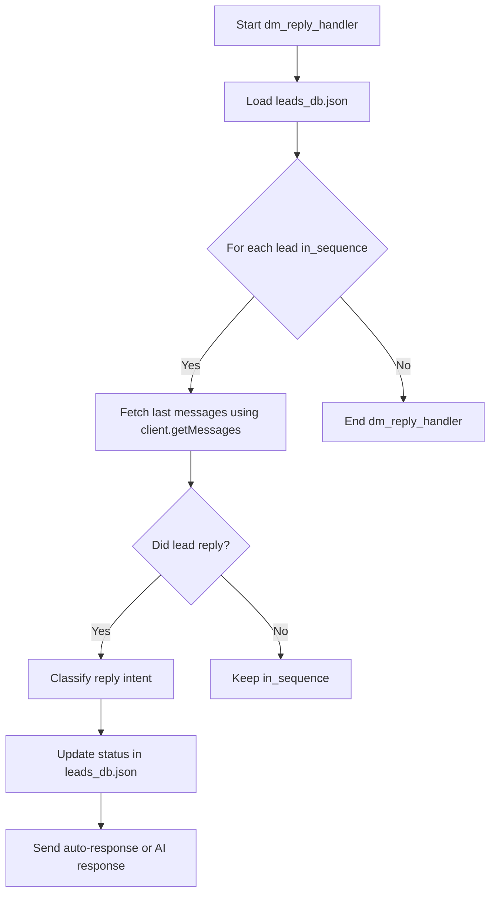

# Product Requirement Document (PRD): Advanced Telegram Growth Engine

## 1. Executive Summary & Market Context

The **WeMagnifAI Telegram Growth Engine** is an autonomous, organic B2B outreach and authority-building application designed to identify high-quality prospects in niche communities, publish content, scrape leads, and conduct automated DM conversations.

### Competitor Benchmarking
We analyzed similar premium applications in the Telegram automation and lead generation space:
1. **TelePilot Pro**: Leading proxy-based client rotation suite. Offers heavy safety systems, account cooling, and automated welcome triggers.
2. **WaDesk / CRMchat.ai**: High-end unified inboxes that sync Telegram messages into CRM pipelines (HubSpot, Salesforce) and use AI agents to respond to inbound replies.
3. **MetricGram**: Focuses on community analytics, group activity scoring, and conversational sentiment triggers.

### Architectural Gaps Resolved in This Version
- **Unaware Outreach Sequences**: The existing outreach engine sent step-by-step follow-ups even if the prospect replied (e.g., sending a CTA after they said "not interested"). We introduce **Dynamic DM Reply Handling**.
- **IP Ban Risks**: Direct connections from a single server IP trigger Telegram's anti-spam. We introduce **SOCKS5 Proxy Support**.
- **Static Outreach Content**: Lack of personalization fields. We introduce **Dynamic Token Replacement**.

---

## 2. Core Functional Requirements

### 2.1 Dynamic DM Reply Handling (`dm_reply_handler.js`)
The engine must check for incoming replies from prospects before deciding to send the next message in a sequence.
- **Polling DMs**: For every prospect marked as `in_sequence` in `leads_db.json`, fetch the last 10 messages from the chat with that user.
- **Reply Detection**: If the last message is from the prospect (newer than our last outreach), mark the lead as `replied`.
- **Objection / Intent Classification**:
  - `not_interested` (e.g. "stop", "no thanks") → Pause sequence, send polite opt-out message, update status to `not_interested`.
  - `busy` (e.g. "later", "busy now") → Pause sequence, send polite reschedule prompt, update status to `paused`.
  - `how_much` (e.g. "cost?", "pricing") → Send pricing card, pause sequence.
  - `tell_me_more` / `interested` → Call OpenAI API to generate a helpful, value-first response referencing the business niche.
  - `default` → Log, pause sequence, notify human outreach assistant.
- **Analytics Sync**: Dynamically calculate actual replies received and feed them to the dashboard analytics.

### 2.2 SOCKS5 Proxy Integration
- The Telegram Client must connect via a proxy if configured in `config.json`.
- Supports SOCKS5 proxy with IP, port, username, and password credentials.

### 2.3 Dynamic Token Replacement
Outreach templates must support dynamic token replacement prior to sending:
- `{First Name}` → Prospects's first name (capitalized, falling back to "there" if blank).
- `{Source Group}` → Niche group title where they were discovered.
- `{Website URL}` → Company URL from `config.json`.

---

## 3. Technical Architecture & Database Schemas

### Sequence Flow Diagram

### Database Updates (`leads_db.json` / `contacted_db.json`)
When a reply is detected, the status fields must update:
- `leads_db.json`:
  - `status`: `replied`, `not_interested`, or `paused`
  - `conversation_state`: `classified_intent` (e.g., `not_interested`)
- `contacted_db.json`:
  - Append the prospect's reply message content and timestamp to the message logs under `messages[]` with type `received`.
